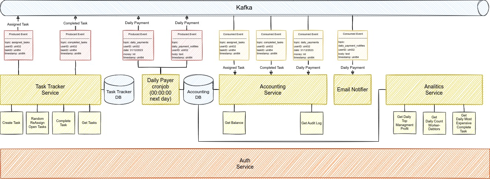

# Homework 0

## Схема

## Сервисы

### Task Tracker Service

Реализует взаимодействие с задачами и только с ними: \
    - создание задачи. Возможность создать задачу и назначить ей ответственного рабочего;
    - переназначение задачи. Возможность сменить ответственного за выполнение задачи;
    - завершение. Возможность завершения (закрытия) задачи;
    - получение списка задач;

#### API

##### Create Task

Создать задачу и назначить отвественного рабочего.

Определены следующие поля:

| Поле | Обязательное | Значение по умолчанию | Описание |
|-------------|-------------|-------------|-------------|
| UserName | Да  | Нет  | Имя ответственного рабочего. нельзя указать пользователя из групп "менеджеры" и "администраторы"|
| Описание | Да  | Нет  | Описание задачи |

При создании автоматически назначается время создания задачи  и ее ID

Права доступа: все

##### Random ReAssign Open Tasks

Позволяет переназначить все открытые задачи между всеми рабочими в случайном порядке.

При переназначении автоматически обновляется время изменения задачи и ее ID

Права доступа: в ТЗ не оговорено, лучше уточнить

##### Complete Task

Завершить задачу.

Определены следующие поля:

| Поле | Обязательное | Значение по умолчанию | Описание |
|-------------|-------------|-------------|-------------|
| TaskID | Да  | Нет  | ID задачи|

Автоматически назначается время завершения задачи.

Права доступа: рабочий, который ответственный за задачу.

##### Get Tasks

Получить список назначенных задач

| Поле | Обязательное | Значение по умолчанию | Описание |
|-------------|-------------|-------------|-------------|
| UserName | Да  | Нет  | Имя ответственного рабочего |

Права доступа: рабочий, который ответственный за задачу. Получает только свой список задач.

#### Связность

- Сервис авторизации
- База данных для хранения списка текущих задач

#### Хранение

- База данных для хранения задач
- Kafka Broker для асинхронной передачи информации о назначении и завершении задач

### Accounting Service

Реализует денежную сторону работы с задачами:
    - оценивает назначение и завершение задач;
    - хранение и получение аудита логов по начисленным выплатам;
    - получение информации о текущем балансе;

#### API

##### Get Balance

Получить текущий баланс (за сутки)

Определены следующие поля:

| Поле | Обязательное | Значение по умолчанию | Описание |
|-------------|-------------|-------------|-------------|
| UserName | Да  | Нет  | Имя пользователя |

Права доступа: рабочие (доступ только к собственному текущему балансу), админы и бухгалтеры (общая статистика по всем заработанным (сегодня (sum(completed task amount) + sum(assigned task fee)) * -1 ) деньгам)

##### Get Audit Log

Получить аудит лог

Определены следующие поля:

| Поле | Обязательное | Значение по умолчанию | Описание |
|-------------|-------------|-------------|-------------|
| UserName | Да  | Нет  | Имя пользователя  |

Права доступа: рабочие (доступ только к собственному аудиту для текущего баланса), админы и бухгалтеры (статистика по дням (??? что это? В аудите такое же есть, нет?))

#### Связность

- Сервис авторизации
- База данных для хранения аудита по назначению и завершению задач, а также выплат
- Kafka Broker для асинхронного получения информации о  назначении и завершении задач

#### Хранение

- База данных для хранения аудита по назначению и завершению задач, а также выплат

### Analytics Service

Реализует получение аналитики:
    - сколько заработал топ-менеджмент (или компания???) за сутки;
    - сколько ушло рабочих в минус за сутки;
    - получение информации о самой дорогой завершенной задачи за период врмени;

#### API

##### Get Daily Top Managment Profit

Cколько заработал топ-менеджмент (или компания???) за сутки.

Права доступа: не указано, но возможно топ-менеджеры, админы, бухгалтеры, менеджеры (???)

##### Get Daily Count Worker-Debtors

Cколько ушло рабочих в минус за сутки.

Права доступа: не указано, но возможно топ-менеджеры, админы, бухгалтеры, менеджеры (???)

##### Get Daily Most Expensive Complete Task

Получение информации о самой дорогой завершенной задачи за период врмени

Права доступа: не указано, но возможно топ-менеджеры, админы, бухгалтеры, менеджеры (???)

#### Связность

- Сервис авторизации
- База данных для хранения аудита по назначению и завершению задач, а также выплат

#### Хранение

- База данных для хранения аудита по назначению и завершению задач, а также выплат

### Daily Payer Cronjob

Каждые сутки в 00:00:00 запускается и формирует информацию какой рабочий и сколько заработал за предыдущие сутки.

После этого отправляет 2 сообщения с подсчитанным в Kafka:
    - для accounting service с целью сохранения инфомрации о выплатах/начислениях рабочим
    - для уведомления (по почте) рабочих об их начислениях за предыдудщеие сутки

#### Связность

- База данных для хранения аудита по назначению и завершению задач, а также выплат
- Kafka Broker

#### Хранение

- База данных для хранения аудита по назначению и завершению задач, а также выплат
- Kafka Broker для отправки информации о суточных выплатах.

### Email Notifier Service

Для отправки по email рабочим информации о выплатах за прошедшие сутки.

#### Связность

- smtp-сервер
- Kafka Broker для получения информации о суточных выплатах.

## Критичиеские моменты/неопределенности

1. Главный момент, который мне сейчас неизвестен - работа с авторизацией:
    - что использовать?
    - как авторизоваться?
    - как сервисы должны быть связаны с сервисом авторизации ?

2. Есть спорные моменты по ТЗ: что-то не досказано, что-то выглядит неочевидным.

3. С kafka работать в проде не приходилось. Могут быть нюансы. Вопрос персистентности kafka вроде понятен, если упадет kafka, то у нее есть персистентность, все неоправотанные events не будут закоммичены. Но что делать, если kafka отвалится, а сервисы не смогут отправить события? Сервисы должны держать кэш событий рядышком, чтобы если что их отправить, когда kafka оживет.

4. Использовать одну общую БД со связями между таблицами, или использовать для каждого сервиса свою БД?
На схеме отражены отдельные БД, но подразумевал, что одна общая БД - с ней работать легче, по идее, но вопрос на сколько это будет правильно с точки зрения высокой нагрузки, миграции БД
